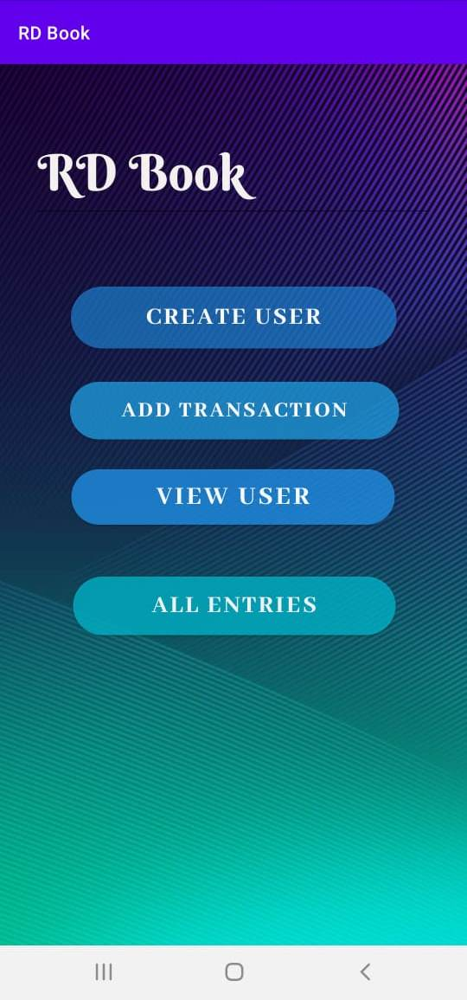
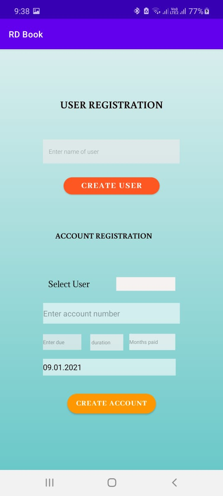
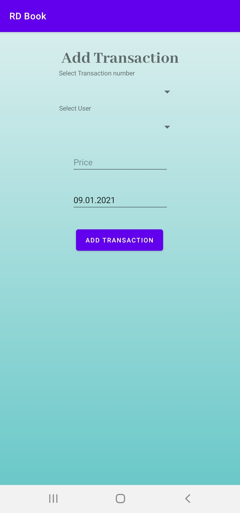
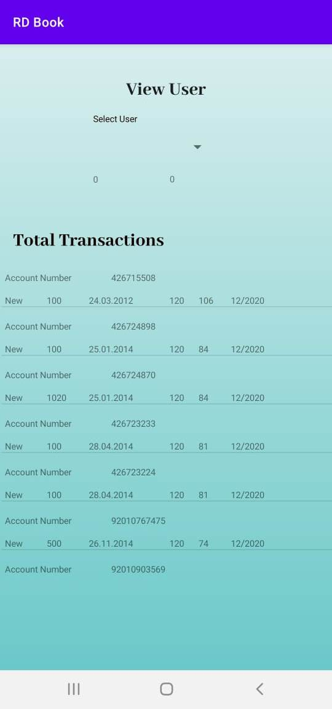
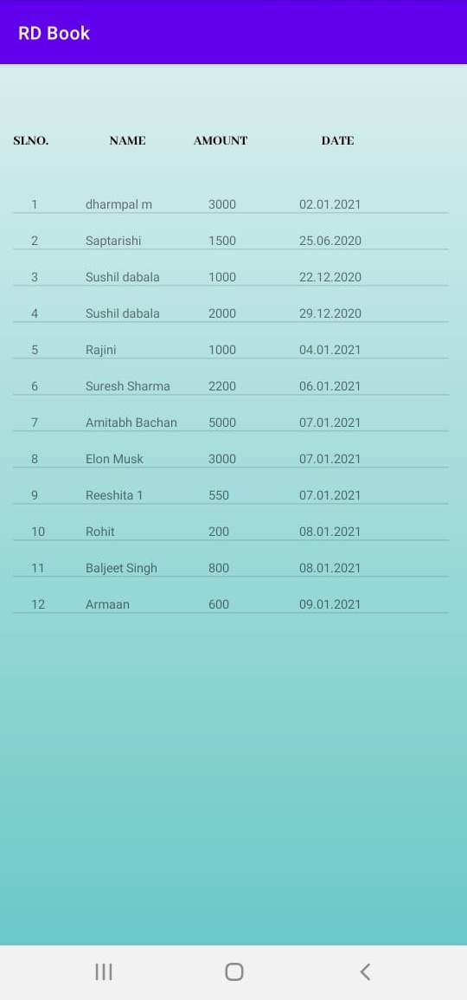

# RD Book
## What is it about
In this app we create a system for tracking Recurring Deposit(RD) of various users with multiple accounts. This app solves the real-time problem of managing a large number of users who could be depositing any sum of money over a long period of time with many accounts.
## What are its unique features
- Allows the creation of multiple accounts for a single user.
- Any transaction made in any point in time can be recorded in current system.
- Any transaction made at one end will be reflected in every device using the app in real time.
- Amount can also be deposited for a certain length of time at once.
## What did we use in making this app
- Kotlin
- Google firebase
## Screenshots of the app in use

This is the opening screen of the app. It shows the various options that are available that the user can choose from. 

This is the screen we see if we choose the create user option. It allows us to create a new user or a new account for an existing user.

This is the screen we see if we choose the add transaction. Here we can input details like transaction number,user name the transaction amount and the date of transaction,by default it takes the present date as the date of transaction

This screen shows if we choose the view user option. This shows all the transactions that have been made against each account and its respective month. We can also choose one user and see all the transactions made by him/her in every account.

This screen shows when we choose all entries option. It shows all the entries that were made along with the date of entry and the total amount deposited by the user.
